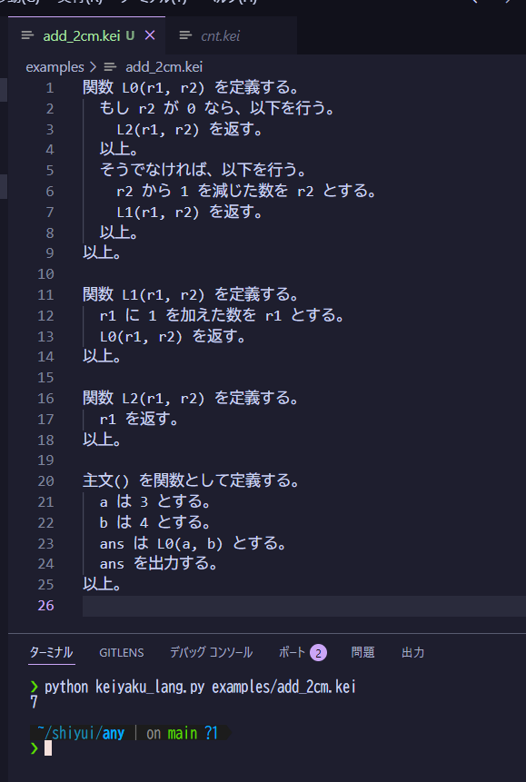

# kei
Interpreter for a small Japanese DSL.

Examples are under `examples/`.

Supported constructs (excerpt):
- 代入: `A は B とする。`
- 出力: `A を出力する。`
- 算術: `X に Y を加えた数を Z とする。` など
- 反復: `N 回、以下を行う。 ... 以上。`
- 関数定義/呼び出し: `関数 F(a, b) を定義する。 ... 以上。` / `F(1, 2)`
- 条件分岐: `もし E が 0 なら、以下を行う。 ... 以上。`（任意で `そうでなければ、以下を行う。 ... 以上。`）

The conditional uses numeric truth:
- `もし X が 0 なら` executes the then-block when `X == 0`.
- `もし X が 0 でなければ` executes the then-block when `X != 0`.
